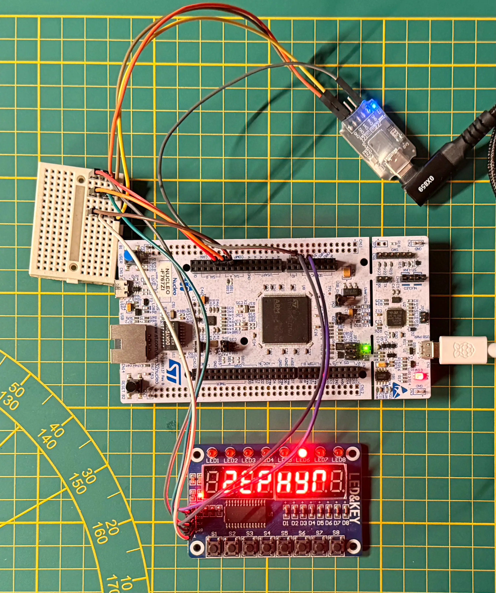

# TM1638 Zephyr Module

[Zephyr RTOS](https://github.com/zephyrproject-rtos/zephyr) driver for the Titan Microelectronics [TM1638 LED driver](http://www.titanmec.com/product/display-drivers/led-panel-display-driver-chip/2022081797.html).



## Getting started

### Board overlay configuration

To use the module, you must define it in your board's  `.overlay` file. Update the pins to match your hardware:

```dts
/ {
	tm1638_0: tm1638 {
        compatible = "titanmicro,tm1638";
        stb-gpios = <&gpiof 0 GPIO_ACTIVE_HIGH>;
        clk-gpios = <&gpiof 1 GPIO_ACTIVE_HIGH>;
        dio-gpios = <&gpiof 2 GPIO_ACTIVE_HIGH>; 
    };
};
```

### Standalone application

The repository provides two samples:
- `basic`: static text and LED animation
- `input`: button polling with LED feedback

### Module

To use this driver in an external Zephyr application, add this repository to your `west.yml` manifest:

```yaml
manifest:
  remotes:
    - name: TM1638-driver-zephyr
      url-base: https://github.com/pkoscik/
  projects:
    - name: TM1638-driver-zephyr
      remote: TM1638-driver-zephyr
      revision: main
      path: modules/drivers/tm1638
```

Run `west update`, and enable the driver in the `prj.conf`

```Kconfig
CONFIG_GPIO=y
CONFIG_TM1638=y
```